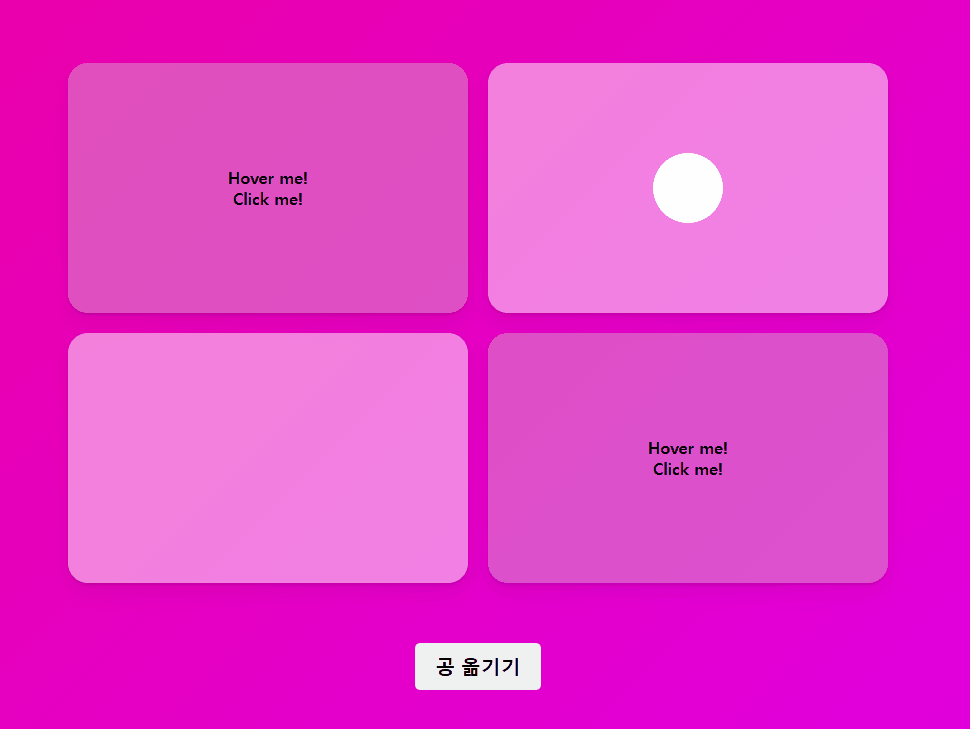
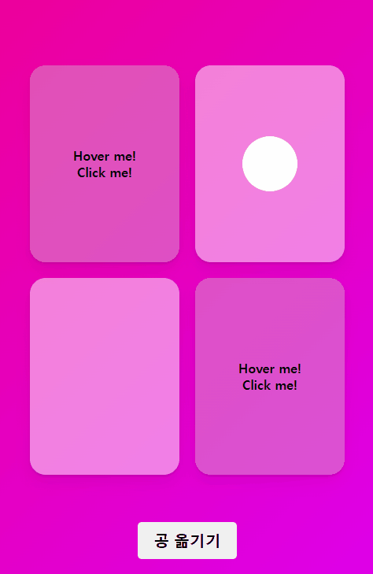

# 🎢 Framer Motion 애니메이션 연습

- React, TypeScript, Framer-motion
- [DEMO 바로가기](https://rigood.github.io/framer-motion/)

<br/>

## 1. Box와 Modal을 자연스럽게 연결하기

- `layoutId`를 이용하여 Box와 Modal을 자연스럽게 연결할 수 있습니다.
- `whileHover`를 통해 hover 시 스타일을 지정할 수 있습니다.



```js
<Box
  onClick={() => setBoxId("first")}
  layoutId={"first"}
  whileHover={{
    scale: 1.1,
    transition: { duration: 0.3 },
  }}
  ref={boxRef}
>
  Hover me! <br /> Click me!
</Box>

{boxId && (
  <Overlay
      onClick={() => setBoxId(null)}
      initial={{ backgroundColor: "rgba(0,0,0,0)" }}
      animate={{ backgroundColor: "rgba(0,0,0,0.5)" }}
      exit={{ backgroundColor: "rgba(0,0,0,0)" }}
  >
      <Modal layoutId={boxId} $boxWidth={getBoxWidth()!}>
         Thank you 🥰
      </Modal>
  </Overlay>
)}
```

</br>

## 2. 반응형 모달

- useRef를 통해 얻은 Box의 offsetWidth 값을 styled-components의 props로 전달하여 창 크기에 따라 모달의 width를 설정합니다.

|                Full Screen                 |                    Responsive                     |
| :----------------------------------------: | :-----------------------------------------------: |
|  |  |

```js
const boxRef = useRef < HTMLDivElement > null;
const getBoxWidth = () => {
  if (boxRef.current) {
    return boxRef.current.offsetWidth;
  }
};
```

```css
const Modal = styled(motion.div)<{ $boxWidth: number }>`
  width: ${({ $boxWidth }) => $boxWidth + "px"};
  // ...
`;
```

</br>

## 3. 공 옮기기

- `layoutId`를 이용하여 Circle을 자연스럽게 switch 할 수 있습니다.


```js
const [circleSwitched, setCircleSwitched] = useState(false);
const switchCircle = () => setCircleSwitched((prev) => !prev);

<Box>{!circleSwitched && <Circle layoutId="switch" />}</Box>
<Box>{circleSwitched && <Circle layoutId="switch" />}</Box>
```

</br>
